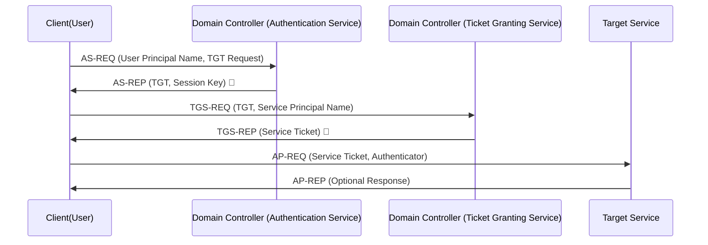

## Introduction

Active Directory (AD) relies on **Kerberos authentication** to securely verify user identities and control access to network resources. Kerberos is a secure, ticket-based protocol that eliminates the need for repeated password entry, reducing the risk of credential theft. 

This blog post breaks down the Kerberos authentication process in AD using a sequence diagram and a step-by-step explanation.

##  Parts of the Kerberos Process

- **🧑 User:** The person attempting to log in.
- **💻 Client:** The user's machine, which initiates authentication requests.
- **🏢 Domain Controller (Authentication Service - AS):** The part of AD responsible for authenticating users and issuing the **Ticket Granting Ticket (TGT)**.
- **🔑 Domain Controller (Ticket Granting Service - TGS):** The component that issues **Service Tickets** for accessing specific resources.
- **🖥️ Target Service:** The resource (e.g., file server, web application) the user wants to access.

## Step-by-Step Kerberos Authentication Flow

### Step 1️⃣: User Logs In
**User → Client:** The user enters their **username and password** into their computer.

### Step 2️⃣: Client Requests Authentication
**Client → AS (Authentication Service):** The client sends an **Authentication Service Request (AS-REQ)** to the Domain Controller. This request contains the user's **Principal Name** and a request for a **TGT (Ticket Granting Ticket)**.

### Step 3️⃣: Authentication Service Responds
**AS → Client:** The **Authentication Service (AS)** verifies the credentials and responds with an **Authentication Service Reply (AS-REP)**, which includes:
- **A TGT (Ticket Granting Ticket)** 🔑
- **A Session Key** (encrypted for security)

### Step 4️⃣: Client Requests Access to a Service
**Client → TGS (Ticket Granting Service):** The client presents the **TGT** and requests a **Service Ticket** via a **TGS-REQ**. This request specifies the **Service Principal Name (SPN)** of the resource the user wants to access.

### Step 5️⃣: Ticket Granting Service Responds
**TGS → Client:** The **TGS** validates the request and issues a **Service Ticket (TGS-REP)** 🎫, which the client can use to access the requested resource.

### Step 6️⃣: Client Accesses the Service
**Client → Target Service:** The client presents the **Service Ticket** to the requested **Target Service** using an **Application Request (AP-REQ)**.

### Step 7️⃣: Service Responds
**Service → Client:** If the Service Ticket is valid, the resource grants access and optionally sends an **Application Reply (AP-REP)** confirming successful authentication.

## 🎨 Visualizing the Kerberos Flow

## Conclusion

Understanding the Kerberos process is essential for IT professionals managing AD environments and ensuring secure authentication so I hoped this helped.