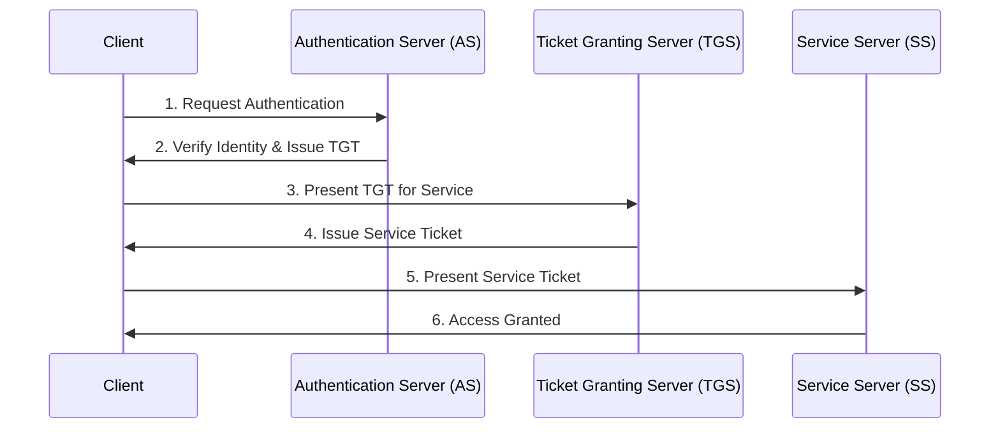

## **Introduction**  

Kerberos is a network authentication protocol that provides secure authentication for users and services over a non-secure network. It is widely used in enterprise environments to authenticate users and services **without transmitting passwords in clear text**.

## Kerberos Authentication Flow

As you read through this article, refer back to this diagram to understand the steps of the Kerberos authentication process.

## **How Kerberos Works**  

Kerberos uses a **trusted third-party authentication server** to verify the identities of users and services. The key components of the Kerberos authentication process are:  

### **1. Authentication Server (AS)**  
🔸 The **AS** is the initial point of contact for users requesting authentication.  
🔸 It verifies the user's identity and issues a **Ticket Granting Ticket (TGT)**.  

### **2. Ticket Granting Server (TGS)**  
🔸 The **TGS** issues service tickets to users based on the **TGT**.  
🔸 Users present the **TGT** to request service tickets for specific services.  

### **3. Key Distribution Center (KDC)**  
🔸 The **KDC** is a centralized authentication server that **combines the AS and TGS functions**.  
🔸 It stores **user credentials** and **service keys** for authentication.  

### **4. Service Server**  
🔸 The **service server** hosts the services that users want to access.  
🔸 It validates the **service ticket** presented by the user and grants access to the requested service.  

## **Kerberos Authentication Process**  

The **Kerberos authentication process** consists of the following steps:  

### **1. User Authentication**  
✅ The user sends a request to the **AS** for authentication.  
✅ The **AS** verifies the user's identity and issues a **TGT** (encrypted with the user's password).  

### **2. Service Request**  
✅ The user presents the **TGT** to the **TGS** to request a service ticket.  
✅ The **TGS** verifies the **TGT** and issues a **service ticket** (encrypted with the service’s secret key).  

### **3. Service Access**  
✅ The user presents the **service ticket** to the **service server**.  
✅ The **service server** decrypts the ticket and grants access to the requested service.  

## **Key Features of Kerberos**  

✔️ **Mutual Authentication:** Ensures that both users and services verify each other’s identities.  
✔️ **Single Sign-On (SSO):** Users can access multiple services with a single authentication.  
✔️ **Ticket-Based System:** Eliminates the need to transmit passwords over the network.  
✔️ **Session Key Generation:** Secure session keys protect data confidentiality.  

---

## 🏁 **Conclusion**  

By using a **trusted third-party authentication server** and **ticket-based system**, Kerberos ensures secure communication over **non-secure networks** without exposing **passwords in clear text**.  
