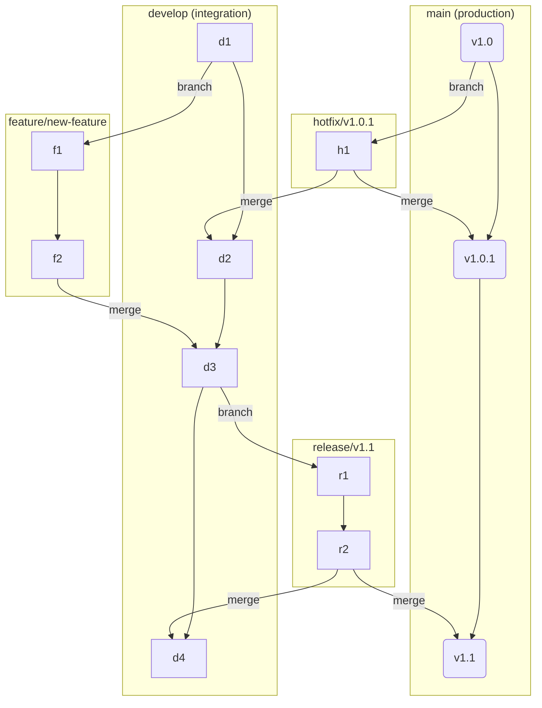
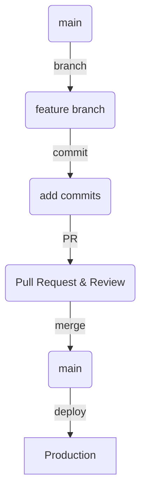
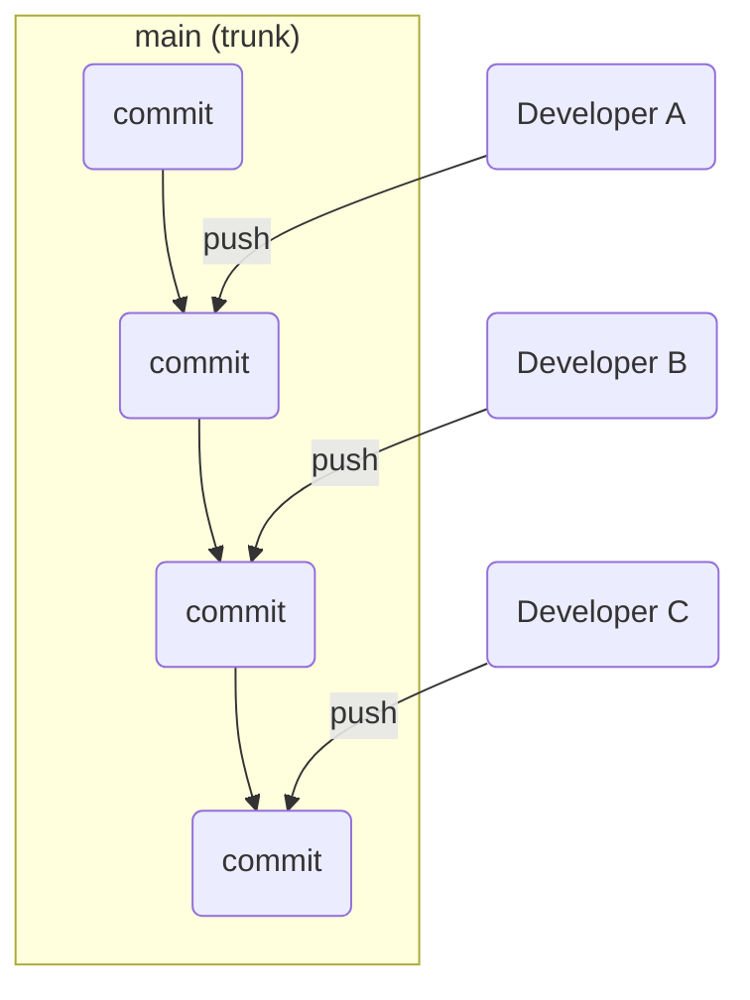

## Introduction

This article explores three popular Git workflows with brief descriptions and examples as part of AZ-400 DevOps Engineer certification preparation.

## Git Workflows Overview 
## 1. Git Flow

Git Flow is a robust branching model designed for projects with scheduled release cycles. It defines a strict branching model with specific roles for different branches.

### Key Branches:
- **`main`**: Contains production-ready code. Only release branches and hotfixes are merged into `main`.
- **`develop`**: The primary development branch where all feature branches are merged.
- **`feature/*`**: Branched from `develop` for new feature development. Merged back into `develop`.
- **`release/*`**: Branched from `develop` to prepare for a new release (bug fixes, documentation). Merged into `main` and `develop`.
- **`hotfix/*`**: Branched from `main` to address critical production issues. Merged back into `main` and `develop`.

### Pros:
- **Structured:** Provides a clear, organized structure for managing code.
- **Parallel Development:** Allows multiple developers to work on features concurrently without interfering with each other.
- **Release Management:** Ideal for projects with explicit versioning and release schedules.

### Cons:
- **Complexity:** Can be overly complex for smaller projects or teams practicing continuous delivery.
- **Slower Pace:** The process can slow down the development and release cycle.

### When to Use:
- Projects with long, scheduled release cycles (e.g., traditional software products).
- Large teams where a structured workflow is necessary to avoid chaos.

## 2. GitHub Flow

GitHub Flow is a lightweight, branch-based workflow that emphasizes simplicity and continuous delivery. The `main` branch is always considered deployable.

### The Process:
1.  **Create a branch:** Create a new, descriptively named branch from `main`.
2.  **Add commits:** Make changes and commit them to your branch.
3.  **Open a Pull Request (PR):** When ready, open a PR to propose and discuss your changes.
4.  **Review and discuss:** Team members review the code, and automated tests run.
5.  **Deploy:** Once reviewed, the branch can be deployed to a staging environment for final testing.
6.  **Merge:** After verification, merge the PR into `main`. The `main` branch is then deployed to production.

### Pros:
- **Simple:** Easy to learn and implement.
- **Fast Feedback:** Pull Requests facilitate code reviews and discussions early in the process.
- **Continuous Delivery:** Encourages frequent deployments and a fast-paced development cycle.

### Cons:
- **Not for Multiple Versions:** Can be challenging for managing multiple versions of a product in production.
- **Requires Strong CI/CD:** Relies heavily on automated testing and deployment pipelines.

### When to Use:
- Web applications and projects that practice continuous deployment.
- Teams that want a simple, fast, and effective workflow.

## 3. Trunk-Based Development (TBD)

Trunk-Based Development is a workflow where all developers commit to a single branch, the `trunk` (usually `main`).

### The Process:
- Developers make small, frequent commits directly to the `trunk`.
- Short-lived feature branches may be used but are merged into the trunk within a few hours or days.
- **Feature flags** are used to hide incomplete features from users in production.
- A comprehensive suite of automated tests is crucial to ensure the trunk is always stable and releasable.

### Pros:
- **Simplicity:** Avoids complex branch management and "merge hell."
- **Continuous Integration:** Code is integrated continuously, reducing the risk of large, conflicting changes.
- **Always Releasable:** The trunk is always in a deployable state.

### Cons:
- **Requires Discipline:** Developers must be diligent about writing tests and not breaking the build.
- **Reliance on Feature Flags:** Requires a robust feature flagging system to manage features.
- **Can be Chaotic:** Without strong testing and discipline, the trunk can become unstable.

### When to Use:
- Mature DevOps teams with a strong culture of testing and CI/CD.
- Projects where rapid iteration and continuous delivery are top priorities.

## Summary Comparison

| Feature | Git Flow | GitHub Flow | Trunk-Based Development |
| :--- | :--- | :--- | :--- |
| **Primary Goal** | Release Management | Continuous Delivery | Continuous Integration |
| **Branching** | Multiple long-lived branches | Short-lived feature branches | Single `trunk` branch |
| **Complexity** | High | Low | Very Low |
| **Release Cycle** | Scheduled, slower | Fast, on-demand | Continuous |
| **Best For** | Versioned software | Web apps, SaaS | Mature CI/CD environments |

## Conclusion

Choosing the right Git workflow depends on your team's size, project type, and release strategy. 
- **Git Flow** offers structure for projects with scheduled releases.
- **GitHub Flow** provides a simple and effective model for continuous delivery.
- **Trunk-Based Development** is the ultimate goal for teams aiming for true continuous integration and rapid iteration.
